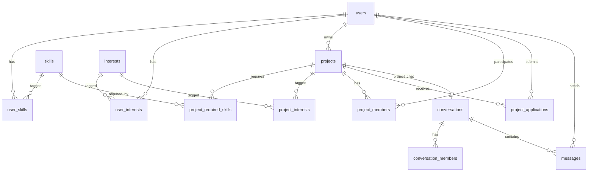

# TeamUp — Backend

REST + WebSocket API for **TeamUp**, a student social network for forming
project teams. Team 28.

## Stack

- **Node.js 18+ / Express 5**
- **MySQL / MariaDB** (driver: `mysql2`)
- **JWT** auth (`jsonwebtoken` + `bcryptjs`)
- **Socket.IO** for real-time chat
- **Nodemailer** (transactional, bilingual emails) + **google-auth-library** (Google Sign-In)
- Hardened by `helmet`, `cors`, **rate limiting** on auth; request logs via `morgan`

## Quick start (local)

```bash
# 1. Start a local MySQL / MariaDB (e.g. XAMPP → MySQL).
# 2. Configure env (DB creds, JWT secret, SMTP, Google client id):
cp .env.example .env

# 3. Install, create the schema + catalog, and run:
npm install
node scripts/load-schema.js  # creates the tables in the configured DB
node scripts/seed-catalog.js # loads the skills / interests catalog
npm run dev                  # API on http://localhost:3000
```

Optional demo data for local testing: `npm run db:seed` (sample users —
password `password`). The production database contains no demo data.

## API overview

All authenticated endpoints expect `Authorization: Bearer <jwt>`.

| Method | Path                                   | Auth | Description                                      |
|--------|----------------------------------------|------|--------------------------------------------------|
| POST   | /api/auth/register                     |  —   | Create account `{ email, password, full_name }` |
| POST   | /api/auth/login                        |  —   | Returns JWT                                      |
| POST   | /api/auth/google                       |  —   | Sign in / up with a Google ID token              |
| POST   | /api/auth/verify                       |  —   | Verify the email with the `XXXX-XXXX` code       |
| POST   | /api/auth/resend                       |  —   | Resend the verification code                     |
| GET    | /api/users/me                          |  ✓   | Current user with skills + interests             |
| PATCH  | /api/users/me                          |  ✓   | Update `full_name`, `bio`, `avatar_url`          |
| PUT    | /api/users/me/skills                   |  ✓   | Replace skill set `[{ skill_id, level }]`        |
| PUT    | /api/users/me/interests                |  ✓   | Replace interests `[interest_id]`                |
| GET    | /api/users/:id                         |  ✓   | Public profile                                   |
| GET    | /api/skills                            |  —   | Catalog                                          |
| GET    | /api/interests                         |  —   | Catalog                                          |
| GET    | /api/projects                          |  ✓   | List open projects                               |
| POST   | /api/projects                          |  ✓   | Create project                                   |
| GET    | /api/projects/:id                      |  ✓   | Project detail (skills, interests, members)      |
| POST   | /api/projects/:id/apply                |  ✓   | Apply to join                                    |
| POST   | /api/projects/:id/applications/:aid    |  ✓   | Owner: `{ "action": "accept" \| "reject" }`     |
| POST   | /api/projects/:id/conversation         |  ✓   | Get-or-create the project team chat              |
| GET    | /api/matching/projects/:id/users       |  ✓   | Top candidates for a project (ranked)            |
| GET    | /api/matching/users/me/projects        |  ✓   | Top projects for the current user (ranked)      |
| GET    | /api/conversations                     |  ✓   | List my conversations                            |
| POST   | /api/conversations/direct/:userId      |  ✓   | Get-or-create a direct conversation              |
| GET    | /api/conversations/:id/messages        |  ✓   | List messages (`?before=&limit=`)                |
| POST   | /api/conversations/:id/messages        |  ✓   | Send a message (also broadcast over Socket.IO)   |
| GET    | /api/posts                             |  ✓   | Social feed (posts + likes + comment counts)     |
| POST   | /api/posts                             |  ✓   | Create a post                                    |
| POST   | /api/posts/:id/like                    |  ✓   | Like / unlike a post                             |
| GET    | /api/posts/:id/comments                |  ✓   | List comments                                    |
| POST   | /api/posts/:id/comments                |  ✓   | Add a comment                                    |
| DELETE | /api/posts/:id                         |  ✓   | Delete (author, or moderator / admin)            |
| GET    | /api/notifications                     |  ✓   | Notification center (with unread count)          |
| GET    | /api/admin/users                       | admin| List / search users                              |
| PATCH  | /api/admin/users/:id/role              | admin| Promote / demote a user                          |

Real-time events are delivered over **Socket.IO** (`message:new` on the
conversation room). A ready-to-run REST Client collection covering the full happy-path
(register → login → create project → match → chat) is provided in
[`requests.http`](requests.http) — compatible with the VS Code
*REST Client* extension.

## Matching algorithm (v0)

For each candidate (user *U*, project *P*):

```
skill_match    = Σ_s∈P.skills (w_p_s · level_u_s)  /  Σ_s∈P.skills (w_p_s · 5)
interest_match = |I_U ∩ I_P|  /  |I_U ∪ I_P|                          (Jaccard)
score          = 0.7 · skill_match + 0.3 · interest_match              (∈ [0, 1])
```

- `w_p_s ∈ {1..5}` — importance the project owner assigned to skill `s`.
- `level_u_s ∈ {1..5}` — self-rated proficiency of user `U` on skill `s`.
- Owner and existing members are excluded from candidates.
- Candidate set is **pre-filtered in SQL** to users with at least one of the
  required skills — no full-table scan over `user_skills`.
- Results sorted by `score` desc, top *N* returned.

Implemented in [`src/services/matching.js`](src/services/matching.js).

**Planned (v1):** TF-IDF on `bio`/`description`, latent factors for cold-start
profiles (no skills declared yet), collaborative filtering on past
participations.

## Database



Full DDL: [`db/schema.sql`](db/schema.sql) — 13 tables, foreign keys with
`ON DELETE CASCADE`, composite indexes on hot lookups.

## Repository layout

```
backend/
├── db/
│   ├── schema.sql           # DDL
│   └── seed.js              # optional demo data (local only)
├── scripts/
│   ├── load-schema.js       # create tables in a fresh/hosted DB
│   └── seed-catalog.js      # load the skills / interests catalog
├── src/
│   ├── config/db.js         # mysql2 pool
│   ├── middleware/auth.js   # JWT + requireRole
│   ├── routes/              # auth, users, projects, posts, matching,
│   │                        #   conversations, notifications, admin, lookup
│   ├── services/            # matching, chat, mailer, settings, notifications
│   ├── utils/{jwt,password,code}.js
│   ├── socket.js            # Socket.IO setup
│   └── index.js
└── requests.http            # REST Client walkthrough (auth → matching → chat)
```

## Status

- [x] Database schema + matching algorithm
- [x] Auth: register, login, bcrypt + JWT, **email verification**, **Google Sign-In**, confirm-by-email changes
- [x] Users / skills / interests / profiles
- [x] Projects + applications + matching
- [x] Social feed (posts, likes, comments)
- [x] **Real-time chat** over Socket.IO (direct + project conversations)
- [x] Notifications
- [x] Moderation & admin (roles, content moderation, admin panel)
- [x] Bilingual (FR/EN) transactional emails
- [x] Flutter mobile app (signed Android release)

## License

MIT — see [`../LICENSE`](../LICENSE).
