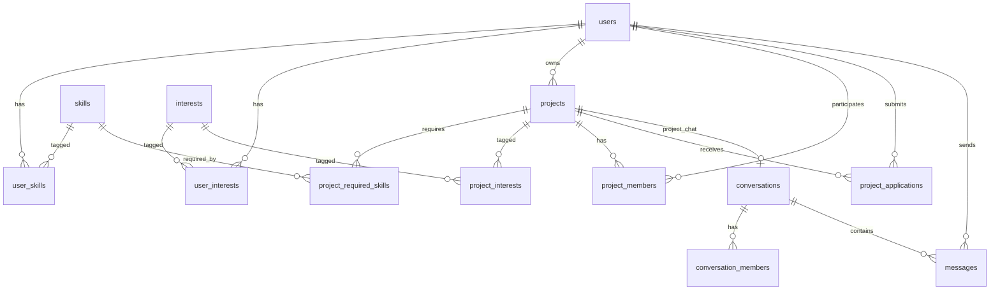

# TeamUp — Backend

REST API for **TeamUp**, a student social network for forming project teams.
Team 28 — Mid-Project Follow-Up (2026-05-05).

## Stack

- **Node.js 18+ / Express 5**
- **MariaDB 10.4+** (driver: `mysql2`)
- **JWT** auth (`jsonwebtoken` + `bcryptjs`)
- Hardened by `helmet`, request logs via `morgan`
- 100% REST, JSON-only

## Quick start (XAMPP / local MariaDB)

```bash
# 1. Start MariaDB from the XAMPP Control Panel (Start → MySQL).
# 2. Apply the schema (creates the `teamup` database):
"C:\xampp\mysql\bin\mysql.exe" -u root < db/schema.sql

# 3. Configure env. On a default XAMPP install set:
#       DB_USER=root
#       DB_PASSWORD=
cp .env.example .env

# 4. Install, seed and run:
npm install
npm run db:seed              # demo users / skills / interests / projects
npm run dev                  # API on http://localhost:3000
```

Demo accounts created by `db:seed` all share the password `password`.

## Quick start (Docker — alternative)

```bash
cp .env.example .env
docker compose up -d         # boots MariaDB, applies schema.sql
npm install
npm run db:seed
npm run dev
```

## API overview

All authenticated endpoints expect `Authorization: Bearer <jwt>`.

| Method | Path                                   | Auth | Description                                      |
|--------|----------------------------------------|------|--------------------------------------------------|
| POST   | /api/auth/register                     |  —   | Create account `{ email, password, full_name }` |
| POST   | /api/auth/login                        |  —   | Returns JWT                                      |
| GET    | /api/users/me                          |  ✓   | Current user with skills + interests             |
| PATCH  | /api/users/me                          |  ✓   | Update `full_name`, `bio`, `avatar_url`          |
| PUT    | /api/users/me/skills                   |  ✓   | Replace skill set `[{ skill_id, level }]`        |
| PUT    | /api/users/me/interests                |  ✓   | Replace interests `[interest_id]`                |
| GET    | /api/users/:id                         |  ✓   | Public profile                                   |
| GET    | /api/skills                            |  —   | Catalog                                          |
| GET    | /api/interests                         |  —   | Catalog                                          |
| GET    | /api/projects                          |  ✓   | List open projects                               |
| POST   | /api/projects                          |  ✓   | Create project                                   |
| GET    | /api/projects/:id                      |  ✓   | Project detail (skills, interests, members)      |
| POST   | /api/projects/:id/apply                |  ✓   | Apply to join                                    |
| POST   | /api/projects/:id/applications/:aid    |  ✓   | Owner: `{ "action": "accept" \| "reject" }`     |
| POST   | /api/projects/:id/conversation         |  ✓   | Get-or-create the project team chat              |
| GET    | /api/matching/projects/:id/users       |  ✓   | Top candidates for a project (ranked)            |
| GET    | /api/matching/users/me/projects        |  ✓   | Top projects for the current user (ranked)      |
| GET    | /api/conversations                     |  ✓   | List my conversations                            |
| POST   | /api/conversations/direct/:userId      |  ✓   | Get-or-create a direct conversation              |
| GET    | /api/conversations/:id/messages        |  ✓   | List messages (`?before=&limit=`)                |
| POST   | /api/conversations/:id/messages        |  ✓   | Send a message                                   |

A ready-to-run REST Client collection covering the full happy-path
(register → login → create project → match → chat) is provided in
[`requests.http`](requests.http) — compatible with the VS Code
*REST Client* extension.

## Matching algorithm (v0)

For each candidate (user *U*, project *P*):

```
skill_match    = Σ_s∈P.skills (w_p_s · level_u_s)  /  Σ_s∈P.skills (w_p_s · 5)
interest_match = |I_U ∩ I_P|  /  |I_U ∪ I_P|                          (Jaccard)
score          = 0.7 · skill_match + 0.3 · interest_match              (∈ [0, 1])
```

- `w_p_s ∈ {1..5}` — importance the project owner assigned to skill `s`.
- `level_u_s ∈ {1..5}` — self-rated proficiency of user `U` on skill `s`.
- Owner and existing members are excluded from candidates.
- Candidate set is **pre-filtered in SQL** to users with at least one of the
  required skills — no full-table scan over `user_skills`.
- Results sorted by `score` desc, top *N* returned.

Implemented in [`src/services/matching.js`](src/services/matching.js).

**Planned (v1):** TF-IDF on `bio`/`description`, latent factors for cold-start
profiles (no skills declared yet), collaborative filtering on past
participations.

## Database



Full DDL: [`db/schema.sql`](db/schema.sql) — 13 tables, foreign keys with
`ON DELETE CASCADE`, composite indexes on hot lookups.

## Repository layout

```
backend/
├── db/
│   ├── schema.sql           # DDL (13 tables)
│   └── seed.js              # demo users + projects + skills + interests
├── src/
│   ├── config/db.js         # mysql2 pool
│   ├── middleware/auth.js   # JWT verification
│   ├── routes/
│   │   ├── auth.js
│   │   ├── users.js
│   │   ├── projects.js
│   │   ├── matching.js
│   │   ├── conversations.js
│   │   └── lookup.js        # /skills, /interests
│   ├── services/matching.js
│   ├── utils/{jwt,password}.js
│   └── index.js
├── requests.http            # REST Client walkthrough (auth → matching → chat)
└── docker-compose.yml       # alternative to XAMPP
```

## Status (2026-05-04)

- [x] Database design (13 tables)
- [x] Backend skeleton (Express 5, JWT, JSON, helmet, morgan)
- [x] Auth (register, login, bcrypt + JWT, email validation)
- [x] Users / skills / interests
- [x] Projects + applications
- [x] Matching algorithm v0
- [x] Chat (REST) — direct + project conversations
- [ ] WebSocket real-time chat (planned)
- [ ] Frontend (Flutter) — workload underestimated, see Figma mockup

## License

MIT — see [`../LICENSE`](../LICENSE).
